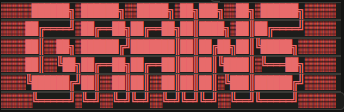

# GRAINS 

 

 
*Granular Browser Sampler*  
- 
   

**Video Demo** 
[Youtube](https://youtu.be/ccXyPcyo36k?si=NmFD9c_f9ruhk9Om)
-

**Tools:** 
Browser-based audio manipulation tool using WEB AUDIO API

## Live Site Deployment:

http://browsergrains.surge.sh/

OR

https://kenneth-rakentine.github.io/Grains/
 

 
 

## Instructions: 

> [!IMPORTANT]
> **ON MOBILE: TURN OFF SILENT MODE ON YOUR PHONE TO HEAR AUDIO PLAYBACK**

 
**CONTROLS**
(use keyboard or on-screen buttons)

1. Drop an audio file into the import window, or click inside to open file browser
2. Press [SPACEBAR] (or 'START' on-screen button) to begin audio playback
3. Use the numeric keys (0-9) to change the start position of the audio file and scan through the waveform manually
4. Use arrow keys (←/→) for fine position navigation
5. Press and hold the alphabetical keys to play the audio chromatically across 3 octaves:

**Q-P**: Upper octave 
**A-L**: Middle octave 
**Z-M**: Lower octave 

Use **RESET** button to restore all parameters to defaults 
Use **MUTE** button to toggle audio output 
Use **LOOP** button to enable/disable looping at current position 
Use **WARP** button to enable/disable micro-loop warping effect at current position 

### **RECORDING AUDIO**

- Load audio file and start playing with granular synthesis
- Press REC button (🔴) 
- Grind your sound into dust particles - everything you hear gets recorded in real-time
- Press STOP to finish recording
- File downloads automatically as grains_[timestamp].webm format
- Compatible with all modern browsers supporting WebM audio
- Use format conversion software or CloudConvert in your browser to convert .webm files to .mp3 for compatibility with other media players: https://cloudconvert.com/webm-to-mp3

 

## **PARAMETERS**

 

**GRANULAR ENGINE** 
 
Grain Size (10-200ms) - Length of each audio "grain" particle 
Density (1-16) - Number of simultaneous grains generated 
Window Scan (0-100%) - Random deviation range from start position 
Grain Shape - 5 envelope types: Blackman, Hanning, Down-Ramp, ExpoDec, Sine 
Time Stretch (0.1-4x) - Playback speed without pitch change 

**ARPEGGIATOR**
 
3x3 Grid - 9-step clickable pattern grid for arpeggio sequence  
Scale Selection - Chromatic, Major, Minor, Dorian, Phrygian, Mixolydian 
Rate (0.5-20Hz) - Arpeggio clock speed driven by sine wave LFO 
Squeeze (0-100%) - LFO waveshaping for rhythmic timing variations 
START/STOP - Enable/disable arpeggiator (triggers when chromatic keys pressed) 

- Activate block to enable note per-scale  
- Inactive blocks skip corresponding scale note 
- Active grid number dictates arp pattern length 
- Press letter key on keyboard OR on-screen chromatic letter buttons beneath oscilloscope to trigger root note arpeggiation through scale according to scale note-select grid 

**BANDPASS FILTER & LFO**
 
Frequency (100-8000Hz) - Resonant bandpass filter center frequency 
Resonance (0.1-3) - Filter resonance/bandwidth 
LFO Speed (0.1-10Hz) - Modulation rate for filter frequency 
LFO Depth (0-100%) - Modulation intensity 
LFO Shape - Sine, Triangle, Sawtooth, Square waveforms 

**NOTCH FILTER**
 
Filter Freq (100-8000Hz) - Notch filter center frequency 
Bandwidth (0.1-30) - Notch filter Q/bandwidth (most effective closer to 0%) 
Wet Mix (0-100%) - Notch filter effect blend 
LFO Rate (0.01-20Hz) - Filter frequency modulation rate 
LFO Depth (0-100%) - Filter frequency modulation depth 

**8-BAND VOCODER**
 
8 Frequency Bands - Individual gain control for 200Hz, 400Hz, 800Hz, 1.2kHz, 1.6kHz, 2.4kHz, 3.2kHz, 4.8kHz 
Vocoder Mix (0-100%) - Blend between dry and vocoded signal 

**WAVEFOLDER & RING MODULATOR**
 
Fold Amount (0-100%) - Harmonic distortion intensity 
Ring Mod Source - Oscillator, Noise, or Grains modulation 
Ring Mod Frequency (20-2000Hz) - Oscillator frequency for ring modulation 
Ring Mod Mix (0-100%) - Effect blend amount 

**SPECTRAL FREEZE & PHASER**
 
Freeze Amount (0-100%) - Spectral freezing intensity using delay feedback 
Spectral Resonance (0-100%) - Resonant filter coloration within freeze effect 
Phaser Rate (0.1-10Hz) - 12-stage phaser LFO speed 
Phaser Depth (0-100%) - Frequency sweep range 
Feedback (0-90%) - Phaser resonance amount 
Gain Boost (0.5-3x) - Output amplification with harmonic saturation 
Phaser Wet Mix (0-100%) - Phaser effect blend amount 

**CHROMATIC ENVELOPE**
 
5-Stage Envelope - Attack, Decay, Sustain, Release, and Hold parameters 
Loop Depth (0-100%) - Overall envelope modulation intensity 
Loop Rate - Frequency of looping envelope 
Loop OFF/ON - Enable/disable envelope looping 

**WARP MODULE**
 
WARP Toggle - Enable/disable high-frequency micro-loop effect 
Loop Rate (1-100Hz) - Micro-loop repetition speed 
Start Point (0-20ms) - Offset within micro-loop section 
Start LFO Speed (0.1-10Hz) - Start point modulation rate 
Start LFO Depth (0-100%) - Start point modulation intensity 
Loop Length (1-20ms) - Duration of micro-loop section 
Length LFO Speed (0.1-10Hz) - Loop length modulation rate 
Length LFO Depth (0-100%) - Loop length modulation intensity 

**3D PANNER & FREQUENCY SHIFTER**
 
X-Axis Depth (0-100%) - Horizontal movement range in binaural field 
Y-Axis Range (0-100%) - Vertical movement range 
Rotation Speed (0-5Hz) - 3D movement rate 
Frequency Shift (-50 to +50Hz) - Pitch shifting without time change 
Freq Shift Mix (0-100%) - Effect blend amount 

**PT2399 ANALOG DELAY**
 
Time (20-600ms) - Delay time with analog character 
Feedback (0-95%) - Delay regeneration amount 
Wow & Flutter (0-100%) - Vintage tape-style pitch modulation 
Lo-Fi Amount (0-100%) - High-frequency filtering for analog warmth 
Soft Clipping (0-100%) - Analog saturation on delay path 
Mix (0-100%) - Wet/dry balance 

**12-BIT REVERB**
 
Size (0-100%) - Virtual room size with early reflections 
Decay (0-100%) - Reverb tail length 
Pre-Delay (0-100ms) - Initial reflection delay 
Wet Gain (0.5-2x) - Reverb signal amplification 
Mix (0-100%) - Reverb blend amount 

**COMB FILTER SEQUENCER**
 
ON/OFF Toggle - Enable 5-stream comb filter sequencer 
Speed (0.5-20Hz) - Sequence clock rate 
Depth (0-100%) - Sequencer effect intensity 
Wet Mix (0-100%) - Wet/dry balance for comb filtering 
Squeeze (0-100%) - Waveform compression effect 
Soft Clip (0-100%) - Harmonic saturation for comb filters 
5-Step Sequence - Individual frequency control (100-2000Hz per step) 

**3-BAND ISOLATOR**
 
Low Band (20-300Hz) - Bass frequency isolation and gain control 
Mid Band (300-3kHz) - Midrange frequency isolation and gain control 
High Band (3kHz-20kHz) - Treble frequency isolation and gain control 

**LIQUEFIER FILTER**
 
Filter Freq (100-8000Hz) - Lowpass filter center frequency 
Resonance (0-100%) - Filter resonance/Q factor 
LFO Depth (0-100%) - Random frequency modulation intensity 
LFO Rate (0.1-20Hz) - Random modulation speed 
Wet Mix (0-100%) - Filter effect blend 
Smooth/Stepped - Choose between smooth or stepped random modulation (low frequency with higher resonance + increased random lfo modulation for watery motion-effect) 

**SPEED CONTROLS**
 
Grain Speed (0.1-4x) - Grain generation speed multiplier 
Loop Speed (0.1-4x) - Loop playback speed multiplier *(ONLY available when "LOOP" Button is activated) 
LOOP Button - Secondary loop toggle (synced with main LOOP button) 

**MASTER CONTROLS**
 
Master Volume (0-200%) - Can boost gain x2 past 100% with dynamic compression 
Preset Management - Save, load, and manage parameter presets 
Mobile Support - Touch-friendly on-screen keyboard for mobile devices 

 

## SIGNAL FLOW  
GRAINS → ARPEGGIATOR → BANDPASS FILTER → NOTCH FILTER → VOCODER → WAVEFOLDER → RING MOD → SPECTRAL FREEZE → PHASER → WARP → 3D PANNER → FREQ SHIFTER → PT2399 → REVERB → COMB SEQ → CHROMATIC ENVELOPE → 3-BAND ISOLATOR → LIQUEFIER → OUTPUT

## Credits:
Help from Claude Sonnet 4